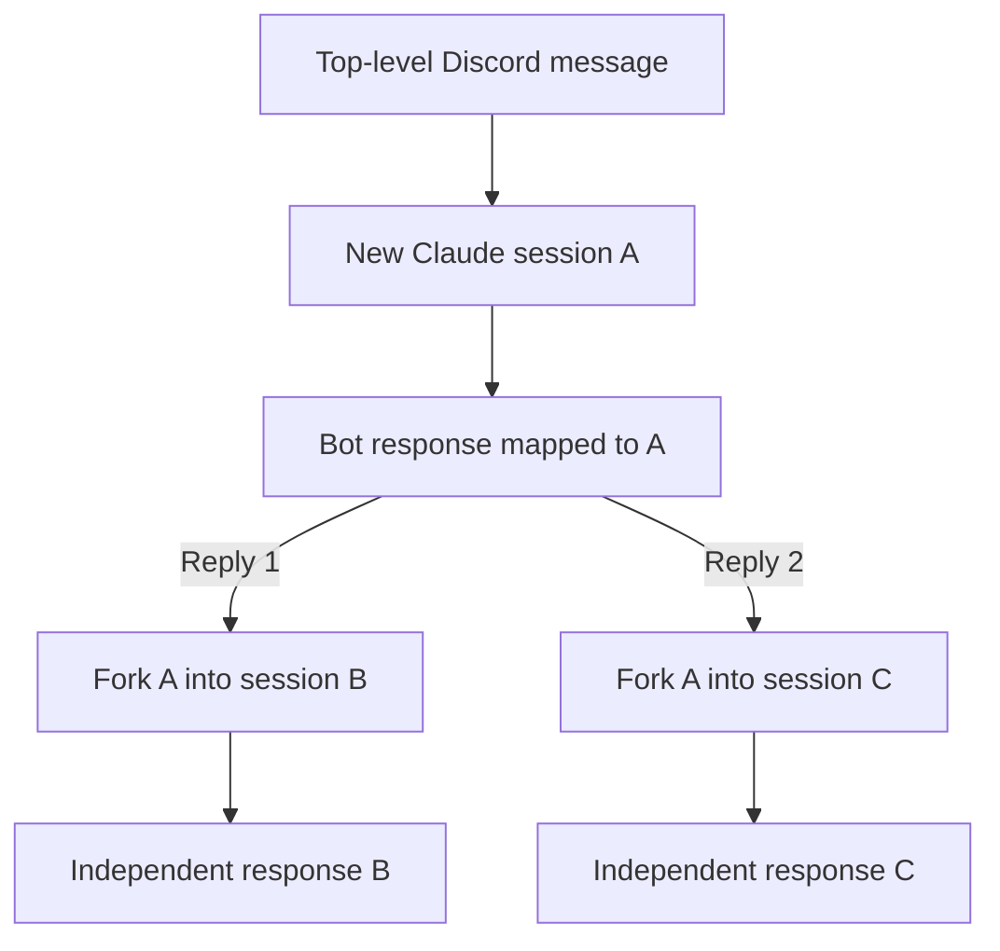

# Odoo Claude Bot

A private Discord bridge to a Claude Code agent grounded in a local Odoo 19.0
workspace. It is designed for tasks such as evidence-based estimates, source-aware
technical reviews, and implementation research using the real Odoo source and an
Odoo MCP integration.

> Status: the text-first v1 implementation is complete and verified with mocked
> Discord, Claude, and MCP integrations. A live operator smoke test remains after
> real credentials are configured.

## Intended experience

Send the bot an authorized top-level Discord message to start a new Claude session:

```text
@Odoo Claude estimate task 6443910
```

Reply to any answer from the bot to branch from exactly that answer:

```text
Bot: The proposed solution needs 18 hours...
└─ You: Re-estimate it without the optional report.
```

Another reply to the original answer creates a separate branch. Neither branch
changes the other one.



## Why this is more useful than a generic chat

Claude runs with `/Users/axelmanzanilla/odoo/versions/19.0` as its working
directory. That gives it access to:

- the exact Odoo 19.0 Community and Enterprise source trees;
- the workspace `CLAUDE.md` and its referenced development conventions;
- customer repositories under `dev/` when permitted;
- the Odoo MCP server for task descriptions, chatter, and other authorized data;
- durable Claude sessions that can be resumed and branched.

The source tree is searched on demand. It is not copied into every prompt or loaded
wholesale into the model context.

## Security model

This bot is private by design, even if Discord permissions are accidentally widened.

- Only IDs in `DISCORD_ALLOWED_USER_IDS` may use it.
- Only IDs in `DISCORD_ALLOWED_GUILD_IDS` are accepted.
- An optional channel allowlist narrows access further.
- Empty or malformed allowlists deny everyone.
- Authorization uses immutable Discord IDs, never usernames or roles.
- Claude starts with read-only tools for source inspection and read-only Odoo MCP
  access.
- Discord input is never interpolated into a shell command.
- Unauthorized requests are ignored before Claude or MCP is invoked.
- Secrets, database files, logs, and session state are excluded from Git.

The first version intentionally does not edit source, mutate Odoo records, post
messages through MCP, or bypass Claude permission checks.

## Architecture


The Claude integration is behind a small interface. The initial implementation uses
the local Claude Code CLI because it already understands the local workspace,
sessions, and stdio MCP configuration. It can later be replaced by Claude Agent SDK
or Managed Agents without rewriting the Discord and database layers.

## Prerequisites

- macOS or Linux.
- Node.js 22.13 or newer.
- Claude Code installed and authenticated.
- Access to the Odoo 19.0 workspace.
- A working, preferably read-only Odoo MCP server. Optional: see
  [Deployment profiles](#deployment-profiles) for the code-search-only profile,
  which runs with no MCP server and no Odoo database access at all.
- A Discord application and bot token.

Verify the local tools:

```bash
node --version
npm --version
claude --version
```

## Discord application setup

1. Create an application in the Discord Developer Portal.
2. Add a bot and copy its token into `DISCORD_TOKEN`.
3. Enable the Message Content intent if the implementation uses ordinary messages.
4. Invite the bot only to the private server with the minimum permissions:
   - View Channels
   - Send Messages
   - Send Messages in Threads
   - Read Message History
   - Add Reactions, if processing reactions are enabled
5. Enable Discord developer mode and copy your user, guild, and optional channel IDs.
6. Put those immutable IDs in the allowlists. Do not use names.

Slash commands may be added for health and administrative actions, but ordinary
message replies are the core conversation interface.

## Deployment profiles

Two supported shapes. Both keep Claude read-only; they differ in whether it can
reach a live Odoo database.

### Full profile (default)

Claude reads the Odoo source tree **and** queries a live database through the Odoo
MCP server. Best for answering questions about actual records, configuration, and
customer data. Requires the MCP setup below and `CLAUDE_REQUIRE_MCP=true`.

### Code-search-only profile

Claude reads only the Odoo 19.0 source tree. There is no MCP server, no database
credentials, and nothing sensitive on the host — the worst outcome of a successful
prompt injection is an inaccurate answer. This is the right profile for a rented
server whose job is answering "how does this Odoo feature actually work?" with
citations from real source instead of recalled approximations.

```dotenv
CLAUDE_REQUIRE_MCP=false
CLAUDE_ALLOWED_TOOLS=Read,Glob,Grep
ODOO_WORKSPACE=/workspace
```

With `CLAUDE_REQUIRE_MCP=false` the startup probe is skipped entirely and `health`
reports `mcp: disabled`, which does not block requests. Leaving it `true` without a
reachable MCP server makes the bot reject every message.

#### Building the workspace

`ODOO_WORKSPACE` is a directory holding the checkouts plus a `CLAUDE.md`. Keep
`CLAUDE.md` at the root rather than inside a checkout, so it does not show up as an
untracked file in someone's git status.

```bash
mkdir -p /srv/odoo-workspace
cd /srv/odoo-workspace

# Community source: what Claude cites in answers.
git clone --depth 1 --branch 19.0 https://github.com/odoo/odoo.git odoo

# Official documentation: lets Claude quote the real docs without network access.
git clone --depth 1 --branch 19.0 https://github.com/odoo/documentation.git documentation
```

Then copy the workspace instructions template from this repository:

```bash
cp deploy/workspace-CLAUDE.md.example /srv/odoo-workspace/CLAUDE.md
```

`deploy/workspace-CLAUDE.md.example` is written for exactly this profile: it tells
Claude to grep before answering, to cite `path:line` for every claim, to say when
something is not in the checkout instead of guessing, and to keep answers sized for
Discord. Edit it to match how you work — it is the single highest-leverage input to
answer quality.

Two things to keep **out** of this workspace:

- **Odoo Enterprise.** It is licensed, not open source. Cloning it to a rented host
  and sending it to a third-party API is a licensing question separate from any
  internal policy. The template tells Claude to say Enterprise source is
  unavailable rather than reconstructing it from memory.
- **Company or customer code and conventions.** Customer repositories, manifest
  metadata, requirements documents, and internal naming schemes are proprietary.
  The template tells Claude not to invent company-specific values.

Cloning the documentation repository is what makes `WebFetch`/`WebSearch` largely
unnecessary — Claude greps the real 19.0 docs locally. If you still want live web
access, add:

```dotenv
CLAUDE_ALLOWED_TOOLS=Read,Glob,Grep,WebFetch,WebSearch
```

Understand the tradeoff before enabling them. A fetched page is untrusted input,
and a URL Claude chooses is an outbound channel, so web access widens the injection
surface in a way local file reads do not. It is a reasonable trade when the
workspace holds only public source, and a poor one once proprietary modules are
present.

Refresh the checkouts periodically so answers track the current 19.0 branch:

```bash
cd /srv/odoo-workspace/odoo && git pull --ff-only
cd /srv/odoo-workspace/documentation && git pull --ff-only
```

## Odoo MCP setup

Claude Desktop and Claude Code do not share MCP configuration automatically. Check
Claude Code from the Odoo workspace:

```bash
cd /Users/axelmanzanilla/odoo/versions/19.0
claude mcp list
```

If Odoo exists only in Claude Desktop, import it for the local project:

```bash
claude mcp add-from-claude-desktop --scope local
claude mcp list
claude mcp get Odoo
```

Alternatively, set `CLAUDE_MCP_CONFIG` to an absolute MCP configuration file used
only by the bot. Do not commit credentials. Use a read-only Odoo account and expose
only the MCP tools the estimation workflow needs.

Before starting the bot, this command must be able to see the Odoo MCP server from
the configured workspace.

## Configuration

Copy the provided `.env.example` to `.env`. The configuration is:

```dotenv
DISCORD_TOKEN=replace-me
DISCORD_APPLICATION_ID=replace-me
DISCORD_ALLOWED_USER_IDS=123456789012345678
DISCORD_ALLOWED_GUILD_IDS=234567890123456789
DISCORD_ALLOWED_CHANNEL_IDS=345678901234567890

ODOO_WORKSPACE=/Users/axelmanzanilla/odoo/versions/19.0
CLAUDE_BIN=claude
CLAUDE_MODEL=
CLAUDE_MCP_CONFIG=
CLAUDE_MCP_SERVER_NAME=Odoo
CLAUDE_REQUIRE_MCP=true
CLAUDE_SETTING_SOURCES=user,project,local
CLAUDE_PERMISSION_MODE=dontAsk
CLAUDE_ALLOWED_TOOLS=Read,Glob,Grep,mcp__Odoo__search,mcp__Odoo__read
CLAUDE_TIMEOUT_MS=900000
CLAUDE_MAX_BUDGET_USD=5
MAX_CONCURRENT_REQUESTS=1
MAX_QUEUED_REQUESTS=50

DATABASE_PATH=./data/bot.sqlite3
LOG_LEVEL=info
SHUTDOWN_GRACE_MS=30000
```

The bot refuses to accept work when required variables are missing. Leaving an
allowlist empty never enables public access. `CLAUDE_ALLOWED_TOOLS` accepts only the
built-in `Read`, `Glob`, `Grep`, `WebFetch`, and `WebSearch` tools plus MCP tool
names that are explicitly read-like. Unknown or mutation-shaped tools fail
configuration validation. `WebFetch` and `WebSearch` are permitted but not enabled
by default; see [Deployment profiles](#deployment-profiles).

`CLAUDE_MCP_CONFIG`, when set, must be an absolute path and contain an
`mcpServers` entry matching `CLAUDE_MCP_SERVER_NAME`. Otherwise startup checks
`claude mcp list` from the Odoo workspace for that server. Setting
`CLAUDE_REQUIRE_MCP=false` skips both checks and marks the component `disabled`.

## Expected development commands

Once implemented:

```bash
npm install
cp .env.example .env
npm run dev
```

Quality checks:

```bash
npm run typecheck
npm run lint
npm test
npm run build
npm audit --audit-level=high
npm run smoke:fake
```

Production-style local execution:

```bash
npm ci
npm run build
npm start
```

## Session and reply behavior

SQLite stores the relationship between Discord response IDs and Claude session IDs.
When you reply to an earlier bot response, the bot looks up that exact message,
forks the associated Claude transcript, and continues the fork. This survives process
restarts.

If one Claude answer requires several Discord messages, every chunk maps to the same
session. Replying to any chunk therefore follows the expected context.

The database stores identifiers and operational metadata by default, not full
conversation content. Discord and Claude remain the transcript surfaces.

## Bot controls

The same user, guild, channel, and message-eligibility allowlists protect controls.
Mention the bot (or use them in a bot-owned thread) with:

- `health` — show configuration, database, Claude, MCP, and Discord readiness;
- `status` — show active and queued request counts;
- `new <request>` — explicitly start a fresh session, even when replying;
- `cancel <Discord user-message ID>` — cancel your queued or running request.

These are text controls; this version does not register slash commands.

## Operating guidance

- Run one Claude request at a time initially. Odoo estimation is usually more limited
  by tool latency and API cost than by Discord throughput.
- Back up the SQLite database if session/reply history matters.
- Rotate Discord and Anthropic credentials periodically.
- Review dependency audit output before upgrades.
- Keep Claude Code, the Odoo source checkout, and MCP server patched.
- Never expose the bot token, Anthropic credentials, or Odoo MCP credentials in
  Discord messages or logs.

### Backup and restore

Stop the bot cleanly, then copy `DATABASE_PATH` to protected storage. Restore it to
the same path before restarting. Stopping first ensures SQLite WAL state is folded
in and avoids an inconsistent copy. The database contains Discord/Claude IDs and
operational metadata, but no prompt or answer bodies by default.

For token rotation, stop the service, replace the affected environment value or
Claude/Odoo credential, verify `claude --version` and `claude mcp list` as the
service account, then restart. Do not paste tokens into Discord or logs.

## Troubleshooting

### The bot ignores my message

Check that your user ID and the guild ID are allowlisted, the channel is allowed, and
the message mentions the bot or replies to one of its responses. The allowlists are
deliberately fail-closed.

### Claude says the Odoo MCP is unavailable

Run the following from `ODOO_WORKSPACE`, under the same operating-system account that
runs the bot:

```bash
claude mcp list
claude mcp get Odoo
```

Claude Desktop configuration alone is not sufficient.

If the bot answers every message with "The Odoo assistant is not ready" and `health`
reports `mcp: unhealthy`, the MCP server is required but not visible. Either fix the
MCP configuration or, if this deployment is not meant to reach an Odoo database at
all, set `CLAUDE_REQUIRE_MCP=false` and drop the `mcp__Odoo__*` entries from
`CLAUDE_ALLOWED_TOOLS`. See [Deployment profiles](#deployment-profiles).

### A reply cannot recover its conversation

The referenced bot message must still have a mapping in the configured SQLite
database. Confirm the bot is using the same `DATABASE_PATH` and that the database was
not deleted.

### A request appears stuck

The default timeout is 15 minutes and global concurrency is one. A later request can
remain queued while an Odoo estimate reads chatter and source. Use `status` and the
structured logs to distinguish queued from running work. Use
`cancel <Discord user-message ID>` to abort a request.

## Discord intents and permissions

Enable the **Message Content** privileged intent. The code also requests the Guilds
and Guild Messages gateway intents. Grant only View Channels, Send Messages, Send
Messages in Threads, Read Message History, and Add Reactions in the private allowed
locations. It does not require Administrator, Manage Messages, or role permissions.

## Manual live smoke test

After filling `.env` with real values:

1. Run `npm ci`, `npm run build`, and `npm start` as the intended service account.
2. Confirm `health` reports every component as `ready`.
3. From an allowed account, mention the bot with a request that requires an Odoo MCP
   task lookup and source inspection.
4. Reply to the answer, then separately reply to the original answer again. Confirm
   the two answers are independent forks.
5. Restart the bot and reply to a pre-restart bot answer.
6. From a denied account, mention and reply to the bot; confirm there is no response
   or Claude activity.
7. Exercise `status`, a deliberately narrow-timeout configuration, and `cancel`.
8. Inspect logs for tokens, prompts, answers, MCP payloads, paths, or stack traces.

The automated suite uses fake Discord envelopes, temporary SQLite databases, and a
fake Claude executable. It verifies authorization, persistence across restart,
create/fork arguments, hostile prompt handling, queueing, cancellation, output
chunking, and failure paths without contacting Discord, Anthropic, or Odoo. No live
Discord, Claude API, or Odoo MCP flow is claimed by this repository verification.

## Running as a service

Run `npm ci && npm run build` during installation, then supervise `npm start` with a
service manager that supplies the environment from a protected file. Set the working
directory to this repository, use a dedicated operating-system account with access
to the Odoo workspace and Claude authentication, restart on failure, and send
SIGTERM for bounded graceful shutdown. Keep credentials out of service definition
files that are committed to Git.

Two ready-made options are included.

### Docker Compose

`Dockerfile` and `docker-compose.yml` build the bot, install the Claude Code CLI,
mount the Odoo source **read-only**, and keep Claude credentials and the SQLite
database in named volumes so forks still resolve after a restart.

```bash
cp .env.example .env                            # tokens, IDs, chosen profile
export ODOO_WORKSPACE_SOURCE=/srv/odoo-workspace  # host path to the workspace
docker compose build
docker compose run --rm bot claude setup-token   # one-time authentication
docker compose up -d
docker compose logs -f
```

The one-time `setup-token` step writes into the `claude-home` volume. Skip it if you
authenticate with `ANTHROPIC_API_KEY` in `.env` instead.

### systemd

`deploy/odoo-claude-bot.service` runs the bot under a dedicated account with
`ProtectSystem=strict`, an empty capability bounding set, and write access limited
to its systemd state directory.

```bash
sudo useradd --system --home-dir /var/lib/odoo-claude-bot \
  --shell /usr/sbin/nologin odoo-claude
sudo install -d -o odoo-claude -g odoo-claude /var/lib/odoo-claude-bot
sudo install -d -o root -g root /opt/odoo-claude-bot
# deploy the repository to /opt/odoo-claude-bot and run npm ci && npm run build
sudo install -o root -g odoo-claude -m 0640 .env /etc/odoo-claude-bot.env
sudo cp deploy/odoo-claude-bot.service /etc/systemd/system/
sudo systemctl daemon-reload
sudo systemctl enable --now odoo-claude-bot
journalctl -u odoo-claude-bot -f
```

Set `DATABASE_PATH=/var/lib/odoo-claude-bot/bot.sqlite3` in the environment file.
Under `ProtectSystem=strict` the state directory is the only writable location, so a
database path inside `/opt` fails at startup.

Authenticate Claude once as that account before enabling the unit, with the same
`HOME` the unit uses:

```bash
sudo -u odoo-claude HOME=/var/lib/odoo-claude-bot claude setup-token
```

The unit sets `ProtectHome=true`, which makes `/home` inaccessible. That is why the
service account's home is `/var/lib/odoo-claude-bot` rather than `/home/odoo-claude`
— authenticating into `/home` would leave the running service unable to read its own
Claude credentials.
