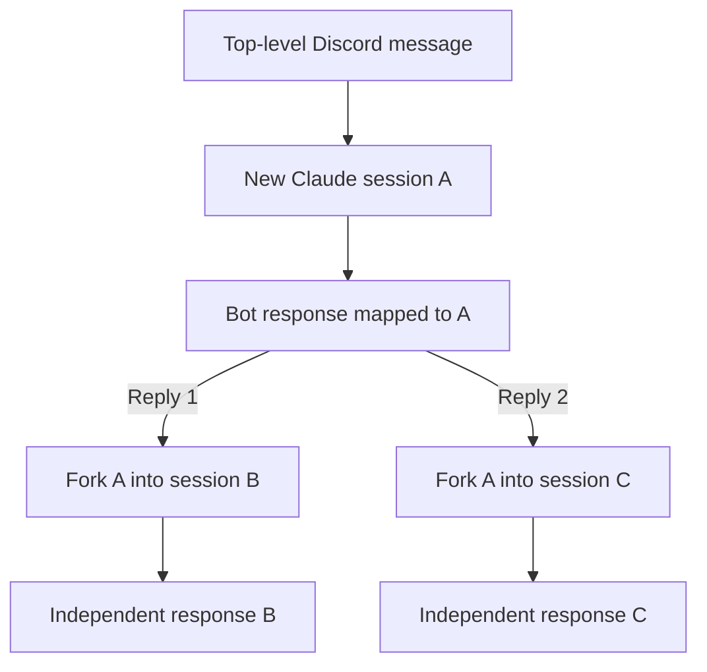
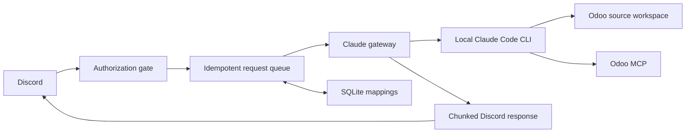

# Odoo Claude Bot

A private Discord bridge to a Claude Code agent grounded in a local multi-version Odoo
workspace. It is designed for tasks such as evidence-based estimates, source-aware
technical reviews, and implementation research using the real Odoo source and an
Odoo MCP integration.

> Status: the text-first v1 implementation is complete and verified with mocked
> Discord, Claude, and MCP integrations. A live operator smoke test remains after
> real credentials are configured.

## Intended experience

Send the bot an authorized top-level Discord message to start a new Claude session:

```text
@Odoo Claude estimate task 6443910
```

Reply to any answer from the bot to branch from exactly that answer:

```text
Bot: The proposed solution needs 18 hours...
└─ You: Re-estimate it without the optional report.
```

Another reply to the original answer creates a separate branch. Neither branch
changes the other one.



## Why this is more useful than a generic chat

Claude runs in the fixed `ODOO_WORKSPACE` directory. A multi-version deployment
uses `/srv/odoo-workspace` on the host (or `/workspace` inside Docker). It can access:

- the installed Odoo Community source versions (and optional Enterprise installed with `--enterprise`);
- the workspace `CLAUDE.md` and its referenced development conventions;
- customer repositories under `dev/` when permitted;
- the Odoo MCP server for task descriptions, chatter, and other authorized data;
- durable Claude sessions that can be resumed and branched.

The source tree is searched on demand. It is not copied into every prompt or loaded
wholesale into the model context.

## Security model

This bot is private by design, even if Discord permissions are accidentally widened.

- Only IDs in `DISCORD_ALLOWED_USER_IDS` may use it.
- Only IDs in `DISCORD_ALLOWED_GUILD_IDS` are accepted.
- An optional channel allowlist narrows access further.
- Empty or malformed allowlists deny everyone.
- Authorization uses immutable Discord IDs, never usernames or roles.
- Claude starts with read-only tools for source inspection and read-only Odoo MCP
  access.
- Discord input is never interpolated into a shell command.
- Unauthorized requests are ignored before Claude or MCP is invoked.
- Secrets, database files, logs, and session state are excluded from Git.

The first version intentionally does not edit source, mutate Odoo records, post
messages through MCP, or bypass Claude permission checks.

## Architecture



The Claude integration is behind a small interface. The initial implementation uses
the local Claude Code CLI because it already understands the local workspace,
sessions, and stdio MCP configuration. It can later be replaced by Claude Agent SDK
or Managed Agents without rewriting the Discord and database layers.

## Prerequisites

- macOS or Linux.
- Node.js 22.13 or newer.
- Claude Code installed and authenticated.
- Access to the Odoo source workspace.
- A working, preferably read-only Odoo MCP server. Optional: see
  [Deployment profiles](#deployment-profiles) for the code-search-only profile,
  which runs with no MCP server and no Odoo database access at all.
- A Discord application and bot token.

Verify the local tools:

```bash
node --version
npm --version
claude --version
```

## Discord application setup

1. Create an application in the Discord Developer Portal.
2. Add a bot and copy its token into `DISCORD_TOKEN`.
3. Enable the Message Content intent if the implementation uses ordinary messages.
4. Invite the bot only to the private server with the minimum permissions:
   - View Channels
   - Send Messages
   - Send Messages in Threads
   - Read Message History
   - Add Reactions, if processing reactions are enabled
5. Enable Discord developer mode and copy your user, guild, and optional channel IDs.
6. Put those immutable IDs in the allowlists. Do not use names.

Slash commands may be added for health and administrative actions, but ordinary
message replies are the core conversation interface.

## Deployment profiles

Two supported shapes. Both keep Claude read-only; they differ in whether it can
reach a live Odoo database.

### Full profile (default)

Claude reads the Odoo source tree **and** queries a live database through the Odoo
MCP server. Best for answering questions about actual records, configuration, and
customer data. Requires the MCP setup below and `CLAUDE_REQUIRE_MCP=true`.

### Code-search-only profile

Claude reads only the installed Odoo source versions. There is no MCP server or
database access. The workspace may contain private Enterprise source if the
operator explicitly installs it. This is the right profile for a rented
server whose job is answering "how does this Odoo feature actually work?" with
citations from real source instead of recalled approximations.

```dotenv
CLAUDE_REQUIRE_MCP=false
CLAUDE_ALLOWED_TOOLS=Read,Glob,Grep
ODOO_WORKSPACE=/workspace
```

With `CLAUDE_REQUIRE_MCP=false` the startup probe is skipped entirely and `health`
reports `mcp: disabled`, which does not block requests. Leaving it `true` without a
reachable MCP server makes the bot reject every message.

#### Building and maintaining a multi-version workspace

Use Git worktrees: one shared bare repository for Odoo, one for documentation,
and optionally one for Enterprise, with separate source directories per branch.
The manager fetches shallow branch snapshots, so it does not download all historical
releases. Each checkout still uses disk space for its files; removing a version removes its checkout, while
shared objects may remain in the Git store.

Run these **on the server host**, from the bot repository, as the account owning
the source directory. Node.js and Git are required. Build after deploying updates:

```bash
cd /opt/odoo-claude-bot
npm ci
npm run build
# If needed, create /srv/odoo-workspace and grant your operator account ownership.
npm run versions -- init --workspace /srv/odoo-workspace
npm run versions -- list --workspace /srv/odoo-workspace
```

This initializes an empty workspace with `CLAUDE.md`, `VERSIONS.md`, and empty
`versions/` and `.repositories/` directories. Installing/building the bot or running
`init` downloads no Odoo code. An empty workspace is valid: Claude reports that it
cannot inspect Odoo source until you explicitly add a version. Other readiness
requirements (Claude authentication, Discord, and MCP when enabled) still apply.

Download only the versions you want, for example:

```bash
npm run versions -- add 16.0 --workspace /srv/odoo-workspace
# Optional additional versions; none are preinstalled or preferred:
npm run versions -- add 18.0 19.0 saas-19.3 saas-19.4 --workspace /srv/odoo-workspace
```

Each version creates `versions/<version>/odoo/` and
`versions/<version>/documentation/`, sharing Git storage in `.repositories/`.

Set `ODOO_WORKSPACE=/srv/odoo-workspace` for systemd/native runs. For Docker,
set `ODOO_WORKSPACE_SOURCE=/srv/odoo-workspace` in Compose's `.env`; Compose
mounts it read-only at `/workspace` and sets `ODOO_WORKSPACE` automatically.
Manage Git on the host: worktree metadata points to host paths and need not be
usable by Git inside the container. Claude reads the mounted source files directly.
The manager requires an explicit absolute **host** path and does not read bot
credentials or `.env`. Do not run it inside the read-only bot container.

Maintenance commands (a branch must exist in each repository being downloaded):

```bash
npm run versions -- add saas-19.4 --workspace /srv/odoo-workspace
npm run versions -- update 19.0 --workspace /srv/odoo-workspace
npm run versions -- update --workspace /srv/odoo-workspace
npm run versions -- remove 18.0 --workspace /srv/odoo-workspace
```

`add` and `remove` are repeatable; `add` preserves an existing checkout, while
`update` explicitly refreshes it. Update/remove refuse modified or unmanaged
worktrees and operator commits; full-version removal also refuses extra files in
the version directory. `update` refreshes only installed repositories, including
Enterprise where present; it never installs a missing repository.
There is no force-delete option.
The generated `VERSIONS.md` reports actual installed repositories and commits,
including partial completion after a network failure. Fix connectivity or a missing
branch and repeat `add`; do not use `update` to finish an incomplete installation.
Commands are serialized by `.odoo-versions.lock`. After an interrupted process,
remove that empty lock directory only after verifying no manager is running.
If an interruption left `.VERSIONS.md.tmp`, remove that generated temporary file
before retrying. Run maintenance with the bot stopped to prevent requests from
reading mixed snapshots while worktrees are updated or removed.

A new workspace receives `deploy/workspace-CLAUDE.md.example` automatically.
Existing `CLAUDE.md` instructions are preserved. The template tells Claude to read
`VERSIONS.md` on every turn and use the explicitly requested version, or the newest
installed Odoo source if the current request does not specify one (including
follow-ups). Version ordering is numeric: `20.0 > saas-19.4 > 19.0 > 18.0 > 16.0`.
If only 16.0 is installed, it answers directly for 16.0. There is no fixed preferred
release and no fallback disclaimer. A release available online but not downloaded
is never selected. Removing the newest installed version selects the next newest;
removing all versions makes source inspection unavailable. Documentation without
Odoo code is not a selectable source version. Answers include versioned citations. No bot tool
permissions are added: these are host administrator commands, not Discord commands.

#### Migrating an existing 19.0 deployment

1. Stop the bot and run the installation commands above using your existing
   workspace root, then explicitly `add` the versions you want. Existing `odoo/`
   and `documentation/` directories are preserved.
2. Back up your workspace `CLAUDE.md`. Merge the **Version selection and workspace
   layout** section from `deploy/workspace-CLAUDE.md.example` and remove conflicting
   instructions that restrict Claude to 19.0. For an uncustomized code-search-only
   workspace, replace it with the template after backing it up:

   ```bash
   cp -n /srv/odoo-workspace/CLAUDE.md /srv/odoo-workspace/CLAUDE.md.before-multiversion
   cp deploy/workspace-CLAUDE.md.example /srv/odoo-workspace/CLAUDE.md
   ```

3. Ensure the service points to the workspace root, not `versions/19.0`. If the
   root changes, reconfigure project-scoped MCP settings there and retain Claude's
   credentials/session volume. Prior sessions may need the old workspace location;
   verify an old reply before removing it.
4. Restart the bot. Ask it to compare `sale.order` in 18.0 and saas-19.4 and verify
   citations from both directories. Test a reply to an earlier answer too. These
   live Discord checks must be run by the operator.
5. Old standalone checkouts are not managed or deleted by this command. After
   checking for custom code, remove/archive them manually if no longer needed.

The legacy single-version layout remains supported when its instructions and
`ODOO_WORKSPACE` are explicitly retained. For new installations, the default
workspace path is `/srv/odoo-workspace`; this is a directory, not a default Odoo
version. Existing installations relying on the former implicit path must set
`ODOO_WORKSPACE` explicitly before upgrading.

#### Optional Enterprise over HTTPS

Ordinary `add` downloads only `https://github.com/odoo/odoo.git` and
`https://github.com/odoo/documentation.git`. `--enterprise` additionally downloads
`https://github.com/odoo/enterprise.git` for the requested versions. It requires
an account with access to that private repository. `design-themes` is not managed.

Configure Git HTTPS authentication on the host as the account that runs the
version commands, not inside the bot container. If Git already has working
credentials, no additional setup is needed. With GitHub CLI (`gh`) installed:

```bash
gh auth login --hostname github.com --git-protocol https --web
gh auth setup-git --hostname github.com
git ls-remote --exit-code https://github.com/odoo/enterprise.git refs/heads/19.0
```

Follow the login URL/device code from your own computer if the server has no
browser. Git reuses GitHub CLI as its credential helper. See
[GitHub authentication](https://cli.github.com/manual/gh_auth_login) and
[Git credential setup](https://cli.github.com/manual/gh_auth_setup-git).
GitHub CLI uses the system credential store when available and otherwise falls
back to a file in its configuration directory. Keep credentials outside the
source workspace; do not embed tokens in URLs, bot configuration, or commands.
The manager disables interactive Git credential prompts, so authenticate first.

After deploying the updated bot and running `npm ci` and `npm run build`, stop
the bot during maintenance. For systemd:

```bash
cd /opt/odoo-claude-bot
sudo systemctl stop odoo-claude-bot
npm run versions -- add 19.0 --enterprise --workspace /srv/odoo-workspace
npm run versions -- list --workspace /srv/odoo-workspace
sudo systemctl start odoo-claude-bot
```

This creates `versions/19.0/enterprise/` alongside `odoo/` and `documentation/`.
The same `add --enterprise` command can add Enterprise to an existing Community
version, preserving its existing snapshots. Failed access or a missing branch
produces an error, retains successful downloads, and records actual availability
in `VERSIONS.md`. Fix access and repeat the command. To finish a partial install,
repeat `add --enterprise`; `update` only refreshes existing checkouts.

For later maintenance, also stop the bot before these operations:

```bash
# Update all installed repositories of this version, including Enterprise.
npm run versions -- update 19.0 --workspace /srv/odoo-workspace
# Remove only Enterprise; preserve Community and documentation.
npm run versions -- remove 19.0 --enterprise --workspace /srv/odoo-workspace
# Remove the whole version, including Enterprise if installed.
npm run versions -- remove 19.0 --workspace /srv/odoo-workspace
```

`--enterprise` is accepted only by `add` and `remove`. Removing Enterprise is
repeatable and does not affect other versions. Shared objects may remain in
`.repositories/enterprise.git`; removing a checkout is not a purge of cached
source. Later `add` or `update` without opt-in does not reinstall removed Enterprise.

For an existing workspace, the manager preserves `CLAUDE.md`. Back it up and merge
the updated template, removing the old "No Odoo Enterprise" rule. If it has no
custom instructions, replace it from the bot repository:

```bash
cp -n /srv/odoo-workspace/CLAUDE.md /srv/odoo-workspace/CLAUDE.md.before-enterprise
cp deploy/workspace-CLAUDE.md.example /srv/odoo-workspace/CLAUDE.md
```

Do this before restarting the bot. Claude then checks Enterprise availability per
version, reads relevant extensions alongside Community, and cites the repository
and version used. The newest installed Community base still selects the version
when none is requested; missing Enterprise never causes a switch to an older
version. Enterprise addons alone are not a complete source version.

Live verification remains an operator step: ask about an installed Enterprise
module, check citations under `versions/<version>/enterprise/`, and repeat after
removing Enterprise. Confirm that the bot reports missing source only when relevant
and still selects the newest installed version.

Customer repositories and company conventions are outside this template's scope.
It must not invent company-specific manifest values or requirements.

Cloning the documentation repository is what makes `WebFetch`/`WebSearch` largely
unnecessary — Claude greps each version’s matching docs locally. If you still want live web
access, add:

```dotenv
CLAUDE_ALLOWED_TOOLS=Read,Glob,Grep,WebFetch,WebSearch
```

Understand the tradeoff before enabling them. A fetched page is untrusted input,
and a URL Claude chooses is an outbound channel, so web access widens the injection
surface in a way local file reads do not. It is a reasonable trade when the
workspace holds only public source, and a poor one once proprietary modules are
present.

## Odoo MCP setup

Claude Desktop and Claude Code do not share MCP configuration automatically. Check
Claude Code from the Odoo workspace:

```bash
cd /srv/odoo-workspace
claude mcp list
```

If Odoo exists only in Claude Desktop, import it for the local project:

```bash
claude mcp add-from-claude-desktop --scope local
claude mcp list
claude mcp get Odoo
```

Alternatively, set `CLAUDE_MCP_CONFIG` to an absolute MCP configuration file used
only by the bot. Do not commit credentials. Use a read-only Odoo account and expose
only the MCP tools the estimation workflow needs.

Before starting the bot, this command must be able to see the Odoo MCP server from
the configured workspace.

## Configuration

Copy the provided `.env.example` to `.env`. The configuration is:

```dotenv
DISCORD_TOKEN=replace-me
DISCORD_APPLICATION_ID=replace-me
DISCORD_ALLOWED_USER_IDS=123456789012345678
DISCORD_ALLOWED_GUILD_IDS=234567890123456789
DISCORD_ALLOWED_CHANNEL_IDS=345678901234567890

ODOO_WORKSPACE=/srv/odoo-workspace
CLAUDE_BIN=claude
CLAUDE_MODEL=
CLAUDE_MCP_CONFIG=
CLAUDE_MCP_SERVER_NAME=Odoo
CLAUDE_REQUIRE_MCP=true
CLAUDE_SETTING_SOURCES=user,project,local
CLAUDE_PERMISSION_MODE=dontAsk
CLAUDE_ALLOWED_TOOLS=Read,Glob,Grep,mcp__Odoo__search,mcp__Odoo__read
CLAUDE_TIMEOUT_MS=900000
CLAUDE_MAX_BUDGET_USD=5
MAX_CONCURRENT_REQUESTS=1
MAX_QUEUED_REQUESTS=50

DATABASE_PATH=./data/bot.sqlite3
LOG_LEVEL=info
SHUTDOWN_GRACE_MS=30000
```

The bot refuses to accept work when required variables are missing. Leaving an
allowlist empty never enables public access. `CLAUDE_ALLOWED_TOOLS` accepts only the
built-in `Read`, `Glob`, `Grep`, `WebFetch`, and `WebSearch` tools plus MCP tool
names that are explicitly read-like. Unknown or mutation-shaped tools fail
configuration validation. `WebFetch` and `WebSearch` are permitted but not enabled
by default; see [Deployment profiles](#deployment-profiles).

`CLAUDE_MCP_CONFIG`, when set, must be an absolute path and contain an
`mcpServers` entry matching `CLAUDE_MCP_SERVER_NAME`. Otherwise startup checks
`claude mcp list` from the Odoo workspace for that server. Setting
`CLAUDE_REQUIRE_MCP=false` skips both checks and marks the component `disabled`.

## Expected development commands

Once implemented:

```bash
npm install
cp .env.example .env
npm run dev
```

Quality checks:

```bash
npm run typecheck
npm run lint
npm test
npm run build
npm audit --audit-level=high
npm run smoke:fake
```

Production-style local execution:

```bash
npm ci
npm run build
npm start
```

## Session and reply behavior

SQLite stores the relationship between Discord response IDs and Claude session IDs.
When you reply to an earlier bot response, the bot looks up that exact message,
forks the associated Claude transcript, and continues the fork. This survives process
restarts.

If one Claude answer requires several Discord messages, every chunk maps to the same
session. Replying to any chunk therefore follows the expected context.

Replies to other users are ignored unless they mention the bot or occur in a
bot-owned thread, including replies containing only an image. Forwarding a message
does not count as replying to the bot and does not resume the forwarded session.
Requests directed at the bot must include text; attachments alone are not supported.

The database stores identifiers and operational metadata by default, not full
conversation content. Discord and Claude remain the transcript surfaces.

## Bot controls

The same user, guild, channel, and message-eligibility allowlists protect controls.
Mention the bot (or use them in a bot-owned thread) with:

- `health` — show configuration, database, Claude, MCP, and Discord readiness;
- `status` — show active and queued request counts;
- `new <request>` — explicitly start a fresh session, even when replying;
- `cancel <Discord user-message ID>` — cancel your queued or running request.

These are text controls; this version does not register slash commands.

## Operating guidance

- Run one Claude request at a time initially. Odoo estimation is usually more limited
  by tool latency and API cost than by Discord throughput.
- Back up the SQLite database if session/reply history matters.
- Rotate Discord and Anthropic credentials periodically.
- Review dependency audit output before upgrades.
- Keep Claude Code, the Odoo source checkout, and MCP server patched.
- Never expose the bot token, Anthropic credentials, or Odoo MCP credentials in
  Discord messages or logs.

### Backup and restore

Stop the bot cleanly, then copy `DATABASE_PATH` to protected storage. Restore it to
the same path before restarting. Stopping first ensures SQLite WAL state is folded
in and avoids an inconsistent copy. The database contains Discord/Claude IDs and
operational metadata, but no prompt or answer bodies by default.

For token rotation, stop the service, replace the affected environment value or
Claude/Odoo credential, verify `claude --version` and `claude mcp list` as the
service account, then restart. Do not paste tokens into Discord or logs.

## Troubleshooting

### The bot ignores my message

Check that your user ID and the guild ID are allowlisted, the channel is allowed, and
the message mentions the bot or replies to one of its responses. The allowlists are
deliberately fail-closed.

### Claude says the Odoo MCP is unavailable

Run the following from `ODOO_WORKSPACE`, under the same operating-system account that
runs the bot:

```bash
claude mcp list
claude mcp get Odoo
```

Claude Desktop configuration alone is not sufficient.

If the bot answers every message with "The Odoo assistant is not ready" and `health`
reports `mcp: unhealthy`, the MCP server is required but not visible. Either fix the
MCP configuration or, if this deployment is not meant to reach an Odoo database at
all, set `CLAUDE_REQUIRE_MCP=false` and drop the `mcp__Odoo__*` entries from
`CLAUDE_ALLOWED_TOOLS`. See [Deployment profiles](#deployment-profiles).

### A reply cannot recover its conversation

The referenced bot message must still have a mapping in the configured SQLite
database. Confirm the bot is using the same `DATABASE_PATH` and that the database was
not deleted.

### A request appears stuck

The default timeout is 15 minutes and global concurrency is one. A later request can
remain queued while an Odoo estimate reads chatter and source. Use `status` and the
structured logs to distinguish queued from running work. Use
`cancel <Discord user-message ID>` to abort a request.

## Discord intents and permissions

Enable the **Message Content** privileged intent. The code also requests the Guilds
and Guild Messages gateway intents. Grant only View Channels, Send Messages, Send
Messages in Threads, Read Message History, and Add Reactions in the private allowed
locations. It does not require Administrator, Manage Messages, or role permissions.

## Manual live smoke test

After filling `.env` with real values:

1. Run `npm ci`, `npm run build`, and `npm start` as the intended service account.
2. Confirm `health` reports every component as `ready`.
3. From an allowed account, mention the bot with a request that requires an Odoo MCP
   task lookup and source inspection.
4. Reply to the answer, then separately reply to the original answer again. Confirm
   the two answers are independent forks.
5. Restart the bot and reply to a pre-restart bot answer.
6. From a denied account, mention and reply to the bot; confirm there is no response
   or Claude activity.
7. Exercise `status`, a deliberately narrow-timeout configuration, and `cancel`.
8. Inspect logs for tokens, prompts, answers, MCP payloads, paths, or stack traces.
9. Outside a bot-owned thread, reply to another user with only an image and forward
   a bot answer without mentioning the bot. Confirm both are silently ignored;
   then reply directly to a bot answer with text and confirm it still branches.

The automated suite uses fake Discord envelopes, temporary SQLite databases, and a
fake Claude executable. It verifies authorization, persistence across restart,
create/fork arguments, hostile prompt handling, queueing, cancellation, output
chunking, and failure paths without contacting Discord, Anthropic, or Odoo. No live
Discord, Claude API, or Odoo MCP flow is claimed by this repository verification.

## Running as a service

Run `npm ci && npm run build` during installation, then supervise `npm start` with a
service manager that supplies the environment from a protected file. Set the working
directory to this repository, use a dedicated operating-system account with access
to the Odoo workspace and Claude authentication, restart on failure, and send
SIGTERM for bounded graceful shutdown. Keep credentials out of service definition
files that are committed to Git.

Two ready-made options are included.

### Docker Compose

`Dockerfile` and `docker-compose.yml` build the bot, install the Claude Code CLI,
mount the Odoo source **read-only**, and keep Claude credentials and the SQLite
database in named volumes so forks still resolve after a restart.

```bash
cp .env.example .env                            # tokens, IDs, chosen profile
export ODOO_WORKSPACE_SOURCE=/srv/odoo-workspace  # host path to the workspace
docker compose build
docker compose run --rm bot claude setup-token   # one-time authentication
docker compose up -d
docker compose logs -f
```

The one-time `setup-token` step writes into the `claude-home` volume. Skip it if you
authenticate with `ANTHROPIC_API_KEY` in `.env` instead.

### systemd

`deploy/odoo-claude-bot.service` runs the bot under a dedicated account with
`ProtectSystem=strict`, an empty capability bounding set, and write access limited
to its systemd state directory.

```bash
sudo useradd --system --home-dir /var/lib/odoo-claude-bot \
  --shell /usr/sbin/nologin odoo-claude
sudo install -d -o odoo-claude -g odoo-claude /var/lib/odoo-claude-bot
sudo install -d -o root -g root /opt/odoo-claude-bot
# deploy the repository to /opt/odoo-claude-bot and run npm ci && npm run build
sudo install -o root -g odoo-claude -m 0640 .env /etc/odoo-claude-bot.env
sudo cp deploy/odoo-claude-bot.service /etc/systemd/system/
sudo systemctl daemon-reload
sudo systemctl enable --now odoo-claude-bot
journalctl -u odoo-claude-bot -f
```

Set `DATABASE_PATH=/var/lib/odoo-claude-bot/bot.sqlite3` in the environment file.
Under `ProtectSystem=strict` the state directory is the only writable location, so a
database path inside `/opt` fails at startup.

Authenticate Claude once as that account before enabling the unit, with the same
`HOME` the unit uses:

```bash
sudo -u odoo-claude HOME=/var/lib/odoo-claude-bot claude setup-token
```

The unit sets `ProtectHome=true`, which makes `/home` inaccessible. That is why the
service account's home is `/var/lib/odoo-claude-bot` rather than `/home/odoo-claude`
— authenticating into `/home` would leave the running service unable to read its own
Claude credentials.
